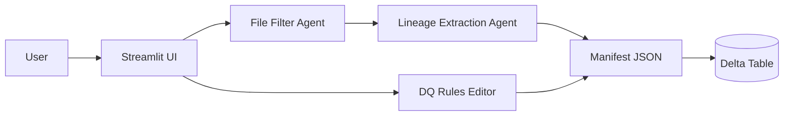

# Agentic RCA System – Databricks-Native Solution Architecture

## System Overview

The Agentic RCA System is a **Databricks-native, production-grade framework** designed to automatically detect, investigate, and explain **row-drop and data anomalies** across **all Databricks Jobs and Delta Live Tables (DLT) pipelines**.

The system is **agnostic within Databricks**:

- Supports **classic Jobs**, **multi-task DAGs**, and **DLT pipelines**
- Works for **batch and streaming**
- Assumes **Unity Catalog (UC)** as the system of record for governance and lineage

A **Two-Phase Architecture** decouples continuous observability collection from on-demand AI-driven investigation, ensuring scalability, low overhead, and explainable RCA.

- **Schema Fetching**: Automatic DDL retrieval using `SHOW CREATE TABLE` for complete table context
- **Pydantic Validation**: Runtime validation for all models (Config, Anomaly, ExecutionContext, etc.)
- **Performance Telemetry**: Built-in performance tracking with phase timers and detailed metrics reporting

---

## Architecture Diagram

```mermaid
graph TD
    subgraph "Phase 1: Observability Collection (Scheduled / Event-driven)"
        Run["Job / Pipeline Run"] --> Collector["Observability Collector"]

        Collector -->|Execution Graph| JobsAPI["Jobs & Pipelines APIs"]
        Collector -->|Lineage| UCLineage["Unity Catalog Lineage"]
        Collector -->|Data Metrics| DeltaLog["Delta Transaction Log"]
        Collector -->|DLT Metrics| DLTMetrics["DLT Event & Expectation Metrics"]
        Collector -->|Validation| Pydantic1["Pydantic Models"]

        Collector -->|Persist| MetricsDelta[("Delta Table: rca.metrics_history")]
    end

    subgraph "Phase 2: RCA Investigation (On-Demand)"
        Trigger["User / Alert / Failure"] --> Orchestrator["RCA Orchestrator"]
        Orchestrator --> Telemetry["Performance Telemetry"]

        Orchestrator --> Context["Execution Context Builder"]
        Context -->|Code| CodeRepo["Repos / Git (Exact Commit)"]
        Context -->|Lineage| UCLineage
        Context -->|Schemas| SchemaFetch["Schema Fetcher (DDL)"]
        Context -->|Validation| Pydantic2["Pydantic Models"]

        Orchestrator --> Validator["Anomaly Detection Engine"]
        Validator --> MetricsDelta
        Validator --> Decision{"Anomaly?"}

        Decision -->|Yes| RCAAgent["RCA Agent (LLM)"]
        Decision -->|No| Report["Report with Metrics"]

        subgraph "LLM Configuration Layer"
            LLMConfig["ModelSettings Manager"]
            LLMConfig -->|Config| RCAAgent
            LLMConfig -->|DATABRICKS_API_BASE| LiteLLM["LiteLLM Integration"]
            LiteLLM -->|Serving Endpoints| DBModel["Databricks Foundation Models"]
        end

        subgraph "Agentic Investigation Loop"
            RCAAgent -->|Tool| SQL["Spark SQL"]
            RCAAgent -->|Tool| DeltaHist["Delta History"]
            RCAAgent -->|Tool| Stats["Null / Distinct / Join Stats"]
            RCAAgent -->|Tool| Schema["Table & Schema Metadata"]
            
            SQL -.->|Error Handling| ErrorHandler["Graceful Degradation"]
            DeltaHist -.->|Error Handling| ErrorHandler
            Stats -.->|Error Handling| ErrorHandler
            Schema -.->|Error Handling| ErrorHandler
            
            ErrorHandler -.->|Retry Logic| RCAAgent
        end

        RCAAgent -->|Max 20 Turns| Report
        Telemetry --> Report
    end
    
    subgraph "UI Validation Tool (Streamlit)"
        UIUser["Data Engineer"] --> StreamlitUI["Streamlit Interface"]
        StreamlitUI --> FilterAgent["File Filter Agent"]
        FilterAgent --> ExtractAgent["Lineage Extraction Agent"]
        ExtractAgent --> ManifestGen["Manifest Generator"]
        StreamlitUI --> DQEditor["DQ Rules Editor"]
        DQEditor -->|Schema-Aware| ManifestGen
        ManifestGen -->|Save| ManifestDelta[("Delta: rca_manifest_log")]
        ManifestGen -->|Token Stats| TokenTracker["Token Usage Monitor"]
        
        LLMConfig -.->|Shared Config| FilterAgent
        LLMConfig -.->|Shared Config| ExtractAgent
    end
```




---

## Core Design Principles

1. **Databricks-Native**

   - Leverages Unity Catalog, Delta Lake, Delta Live Tables, and Jobs APIs directly

2. **Execution-First Reasoning**

   - RCA is driven by _what actually ran_, not static code assumptions

3. **Evidence-Based AI**

   - LLMs form hypotheses but must validate them using real metrics and data

4. **Non-Invasive**
   - No changes required to existing pipeline or business logic

---

## Core Components

## 1. Observability Collector (Phase 1)

### Role

The **Sentry**. Captures authoritative execution and data-change signals after every Job or Pipeline run.

### Inputs

- Job runs (classic Jobs)
- Pipeline runs (DLT)
- Unity Catalog lineage
- Delta transaction logs
- DLT metrics and expectations

### Responsibilities

#### Execution Discovery

- Job → task DAG
- Pipeline → table DAG
- Task → notebook / file mapping
- Runtime parameters and execution mode (incremental vs full)

#### Data Change Capture

For each write operation:

- Rows read
- Rows written
- Rows inserted / updated / deleted
- Rows rejected (DLT expectations)
- Operation type (`INSERT`, `MERGE`, `OVERWRITE`)
- Execution type (batch / streaming)

#### Persistence

All metrics are written to:

```
rca.metrics_history
(
  run_id,
  job_or_pipeline_id,
  step_id,
  step_type,
  source_tables,
  target_table,
  rows_in,
  rows_out,
  rows_rejected,
  operation_type,
  execution_mode,
  timestamp
)
```

This table represents the **historical memory** of the RCA system.

---

## 2. Anomaly Detection Engine

### Role

The **Monitor**. Determines whether a pipeline run exhibits anomalous data behavior.

### Detection Logic

- Statistical deviation (rolling baseline, Z-score)
- Absolute thresholds (e.g., >20% unexplained row drop)
- Execution-aware rules:
  - Full refresh vs incremental
  - Backfill suppression
  - Streaming watermark awareness

### Output

- Suspect steps
- Localized data-loss boundaries
- Confidence score

---

## 3. Execution Context Builder

### Role

The **Context Assembler**. Constructs the factual execution universe for RCA.

### Responsibilities

- Identify exact run, step, and task
- Retrieve UC lineage (upstream & downstream)
- Load table schemas and versions
- Fetch notebook / repo code at execution commit
- Classify execution semantics:
  - Join types
  - Filters
  - Deduplication
  - Incremental logic
  - Streaming vs batch

⚠️ Logic extraction is treated as **hypothesis input**, not ground truth.

---

## 4. RCA Agent (Agentic Investigation)

### Role

The **Detective**. Performs hypothesis-driven root cause analysis.

### Capabilities

- Hypothesis generation
- Evidence validation using live queries
- Cause ranking with confidence

### Example Output

```
Root Cause:
  INNER JOIN on customer_id dropped 82% of rows

Location:
  Job: orders_pipeline
  Task: silver_orders_transform
  Notebook: /repos/etl/orders_silver.py

Evidence:
  - Rows before join: 10.2M
  - Rows after join: 1.8M
  - 79% of join keys missing in right table

Confidence: High (0.87)
```

---

## 5. Schema Fetcher

### Role

The **Schema Provider**. Automatically retrieves table DDL for complete schema context.

### Responsibilities

- Fetch DDL using `SHOW CREATE TABLE` for all source and target tables
- Cache schemas to avoid repeated queries
- Handle errors gracefully for inaccessible tables
- Provide complete table structure to RCA Agent

### Benefits

- AI agent has full column names, types, and constraints
- Better hypothesis generation for data quality issues
- Improved investigation of schema-related problems

---

## 6. Pydantic Validation

### Role

The **Data Guardian**. Ensures data integrity through runtime validation.

### Coverage

All core models use Pydantic BaseModel:
- `Config` - Configuration with URL and threshold validators
- `ExecutionContext` - Execution state validation
- `Anomaly` - Severity and value constraints
- `StepInfo` - Pipeline step validation
- `MetricRecord` - Row count validation
- `PerformanceMetrics` - Telemetry data validation

### Benefits

- Catches invalid data at creation time
- Clear, actionable error messages
- Automatic JSON serialization/deserialization
- Self-documenting field constraints

---

## 7. Performance Telemetry

### Role

The **Performance Observer**. Tracks execution time across all workflow phases.

### Tracked Metrics

- **Discovery Time**: Git cloning and job definition fetching
- **Context Build Time**: Code + lineage + schema assembly per step
- **Detection Time**: Anomaly detection across all steps
- **Investigation Time**: AI agent analysis duration
- **Total Time**: End-to-end workflow execution

### Output

Performance metrics included in final report:
```markdown
## Performance Metrics

- **Total Execution Time**: 45.23s
- **Discovery**: 8.12s
- **Context Building**: 22.45s (15 steps)
- **Anomaly Detection**: 3.21s
- **AI Investigation**: 11.45s (3 anomalies)

**Average Time per Step**: 1.50s
```

### Benefits

- Identify performance bottlenecks
- Track optimization improvements over time
- Debug slow executions
- Capacity planning insights

---

## 8. LLM Configuration Management

### Role

The **Model Orchestrator**. Manages LLM settings and credentials for AI-powered investigation.

### Components

#### ModelSettings Standardization
- Uses `ModelSettings` class from `agents` library across all agents
- Centralizes temperature, max_tokens, and timeout configuration
- Ensures consistency between RCA Agent and UI Validation Tool

#### LiteLLM Integration
- Automatic configuration of `DATABRICKS_API_BASE` with `/serving-endpoints` suffix
- Graceful initialization with try-except error handling
- Supports Databricks Foundation Model serving endpoints

#### Configuration Validation
- Explicit checks for `databricks-sdk` installation
- Clear error messages for missing credentials
- Prevents initialization failures from crashing the system

### Agent Settings

```python
model_settings = ModelSettings(
    temperature=0.1,      # Low for deterministic analysis
    max_tokens=10000,     # Sufficient for detailed reports
    timeout=60,           # 60s timeout for LLM calls
    include_usage=True    # Track token consumption
)
```

### Max Turns Configuration
- RCA Agent: 20 turns (increased from default 10)
- Allows thorough investigation with multiple tool calls
- Prevents premature termination during complex analysis

---

## 9. Error Handling & Resilience

### Role

The **Safety Net**. Ensures system stability despite missing data or failed operations.

### Strategies

#### Graceful Degradation
- Tools return error messages instead of crashing
- Agent continues investigation with partial data
- Missing tables handled as investigation clues

#### Retry Logic
- LLM calls: 3 retries with exponential backoff
- Configurable retry delay (default 2s)
- Detailed error logging with stack traces

#### Validation
- Pydantic models validate all inputs
- Configuration errors caught at startup
- Clear, actionable error messages

### Example Error Handling

```python
try:
    if self.databricks_token:
        self.model = LitellmModel(
            model=self.llm_model,
            api_key=self.databricks_token
        )
    else:
        logger.warning("DATABRICKS_TOKEN missing. LitellmModel not initialized.")
        self.model = None
except Exception as e:
    logger.error(f"Failed to initialize LitellmModel: {e}")
    self.model = None
```

---

## 10. UI Validation Tool

### Role

The **Interactive Analyzer**. Provides a Streamlit-based interface for lineage analysis and data quality rule management.

### Features

#### AI-Powered Lineage Extraction
- Two-agent pipeline: File filtering → Lineage extraction
- Analyzes notebook/SQL code to identify table dependencies
- Generates structured lineage manifests with source/target mappings

#### Data Quality Rules Management
- Schema-aware column selection with dynamic dropdown
- Real-time validation feedback
- Support for multiple check types:
  - Null checks
  - Uniqueness validation
  - Freshness monitoring
  - Custom SQL expressions

#### Manifest Persistence
- Saves to local JSON and Databricks Delta table
- Includes token usage statistics
- Tracks source files and logic summaries

### Architecture



### Configuration

Uses same `ModelSettings` as RCA system for consistency:
- Shared LLM configuration
- Unified error handling
- Common Databricks authentication

---

## Key Benefits

- **Databricks-Native**: Fully integrated with Unity Catalog, Delta Lake, and Jobs APIs
- **Execution-Aware RCA**: Analyzes what actually ran, not static code
- **Scalable & Cost-Efficient**: Two-phase architecture separates collection from investigation
- **Evidence-Backed AI**: LLM hypotheses validated with real data queries
- **Robust Error Handling**: Graceful degradation with comprehensive retry logic
- **Standardized LLM Config**: Consistent ModelSettings across all agents
- **Interactive UI**: Streamlit tool for lineage analysis and DQ rule management
- **Performance Tracking**: Built-in telemetry for optimization insights
- **Token Usage Monitoring**: Track LLM costs per analysis

---

## Summary

This Agentic RCA System treats Databricks pipelines as **observable execution graphs**.  
By combining **Unity Catalog lineage**, **Delta transaction metrics**, and **agentic reasoning**, it delivers accurate, explainable root cause analysis for data anomalies across all Databricks jobs and pipelines.

