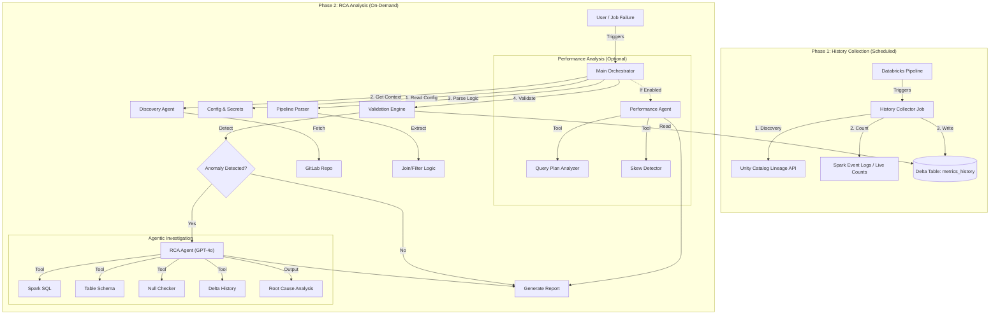

# Agentic RCA System - Solution Architecture

## System Overview
The Agentic RCA System is a production-grade framework designed to automatically detect, diagnose, and explain row drop anomalies in Databricks ETL pipelines. It utilizes a **Two-Phase Architecture** to decouple metric collection from ongoing analysis, ensuring 24/7 monitoring with on-demand AI investigation.

## Architecture Diagram

## Core Components

### 1. History Collector (Standalone Process)
*   **Role**: The "Sentry". Runs passively after every pipeline execution.
*   **Function**: Discovery of tables via Unity Catalog Lineage, efficient row counting via Spark Event Logs (or fallback to live counts), and writing to the historical Delta table.
*   **Output**: A time-series dataset of `(job_id, task_key, input_count, output_count, drop_rate)` stored in `rca_catalog.metrics_history`.

### 2. Validation Engine
*   **Role**: The "Monitor".
*   **Function**: Reads from the `metrics_history` Delta table. It compares the latest run's drop rate against a historical baseline using Z-score statistical anomaly detection.
*   **Trigger**: If an anomaly (e.g., >3 standard deviations or >20% unexplained drop) is found, it flags the step for RCA.

### 3. Discovery & Parsing Agents
*   **Role**: The "Context Builders".
*   **Function**: 
    *   **Discovery Agent**: Fetches Job context from Databricks and clones the exact code version from GitLab.
    *   **Pipeline Parser**: Analyzes PySpark/SQL code to understand *intent* (e.g., "This step creates a LEFT JOIN on `customer_id`"). Note: It relies on Lineage API for table names, focusing only on logic extraction.

### 4. RCA Agent (The "Detective")
*   **Role**: The "Investigator".
*   **AI Model**: GPT-4o via OpenAI Agents SDK.
*   **Function**: Receives the step code, anomaly details, and schemas. It iteratively calls tools to test hypotheses:
    *   *Hypothesis*: "Join keys might be NULL." -> *Tool*: `count_nulls_in_column`.
    *   *Hypothesis*: "Data was overwritten." -> *Tool*: `get_delta_history`.

### 5. Performance Agent (The "Optimizer")
*   **Role**: The "mechanic".
*   **Function**: Optional module for debugging slowness.
*   **Tools**: Inspects physical query plans for full table scans, spills, and data skew.

## Key Benefits
1.  **Non-Invasive**: No changes required to existing pipeline code.
2.  **Scalable**: "Analysis" is decoupled from "Execution". RCA can be run hours later or only on failure.
3.  **Intelligent**: Uses LLMs not just to summarize, but to *investigate* using actual SQL tools.
