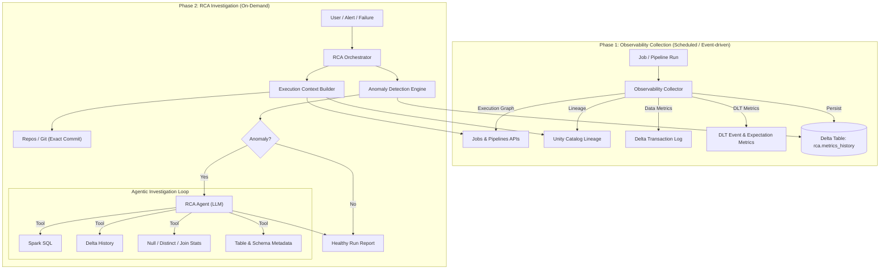

# Agentic RCA System – Databricks-Native Solution Architecture

## System Overview

The Agentic RCA System is a **Databricks-native, production-grade framework** designed to automatically detect, investigate, and explain **row-drop and data anomalies** across **all Databricks Jobs and Delta Live Tables (DLT) pipelines**.

The system is **agnostic within Databricks**:

- Supports **classic Jobs**, **multi-task DAGs**, and **DLT pipelines**
- Works for **batch and streaming**
- Assumes **Unity Catalog (UC)** as the system of record for governance and lineage

A **Two-Phase Architecture** decouples continuous observability collection from on-demand AI-driven investigation, ensuring scalability, low overhead, and explainable RCA.

---

## Architecture Diagram



---

## Core Design Principles

1. **Databricks-Native**

   - Leverages Unity Catalog, Delta Lake, Delta Live Tables, and Jobs APIs directly

2. **Execution-First Reasoning**

   - RCA is driven by _what actually ran_, not static code assumptions

3. **Evidence-Based AI**

   - LLMs form hypotheses but must validate them using real metrics and data

4. **Non-Invasive**
   - No changes required to existing pipeline or business logic

---

## Core Components

## 1. Observability Collector (Phase 1)

### Role

The **Sentry**. Captures authoritative execution and data-change signals after every Job or Pipeline run.

### Inputs

- Job runs (classic Jobs)
- Pipeline runs (DLT)
- Unity Catalog lineage
- Delta transaction logs
- DLT metrics and expectations

### Responsibilities

#### Execution Discovery

- Job → task DAG
- Pipeline → table DAG
- Task → notebook / file mapping
- Runtime parameters and execution mode (incremental vs full)

#### Data Change Capture

For each write operation:

- Rows read
- Rows written
- Rows inserted / updated / deleted
- Rows rejected (DLT expectations)
- Operation type (`INSERT`, `MERGE`, `OVERWRITE`)
- Execution type (batch / streaming)

#### Persistence

All metrics are written to:

```
rca.metrics_history
(
  run_id,
  job_or_pipeline_id,
  step_id,
  step_type,
  source_tables,
  target_table,
  rows_in,
  rows_out,
  rows_rejected,
  operation_type,
  execution_mode,
  timestamp
)
```

This table represents the **historical memory** of the RCA system.

---

## 2. Anomaly Detection Engine

### Role

The **Monitor**. Determines whether a pipeline run exhibits anomalous data behavior.

### Detection Logic

- Statistical deviation (rolling baseline, Z-score)
- Absolute thresholds (e.g., >20% unexplained row drop)
- Execution-aware rules:
  - Full refresh vs incremental
  - Backfill suppression
  - Streaming watermark awareness

### Output

- Suspect steps
- Localized data-loss boundaries
- Confidence score

---

## 3. Execution Context Builder

### Role

The **Context Assembler**. Constructs the factual execution universe for RCA.

### Responsibilities

- Identify exact run, step, and task
- Retrieve UC lineage (upstream & downstream)
- Load table schemas and versions
- Fetch notebook / repo code at execution commit
- Classify execution semantics:
  - Join types
  - Filters
  - Deduplication
  - Incremental logic
  - Streaming vs batch

⚠️ Logic extraction is treated as **hypothesis input**, not ground truth.

---

## 4. RCA Agent (Agentic Investigation)

### Role

The **Detective**. Performs hypothesis-driven root cause analysis.

### Capabilities

- Hypothesis generation
- Evidence validation using live queries
- Cause ranking with confidence

### Example Output

```
Root Cause:
  INNER JOIN on customer_id dropped 82% of rows

Location:
  Job: orders_pipeline
  Task: silver_orders_transform
  Notebook: /repos/etl/orders_silver.py

Evidence:
  - Rows before join: 10.2M
  - Rows after join: 1.8M
  - 79% of join keys missing in right table

Confidence: High (0.87)
```

---

## Key Benefits

- Databricks-first and UC-native
- Execution-aware RCA
- Scalable and cost-efficient
- Evidence-backed, explainable AI

---

## Summary

This Agentic RCA System treats Databricks pipelines as **observable execution graphs**.  
By combining **Unity Catalog lineage**, **Delta transaction metrics**, and **agentic reasoning**, it delivers accurate, explainable root cause analysis for data anomalies across all Databricks jobs and pipelines.
